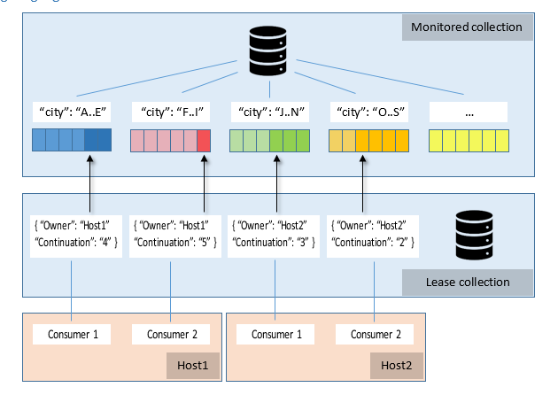

# Change Feed Processor library
This library provides a host for distributing change feed events in partitioned collection across multiple observers. Instances of the host can scale up (by adding) or down (by removing) dynamically, and the load will be automatically distributed among active instances in about-equal way.

## NB Superseded by production-quality component

This sample has graduated to become a first class component [with it's own repo - see `azure-documentdb-changefeedprocessor-dotnet`](https://github.com/Azure/azure-documentdb-changefeedprocessor-dotnet)

## Design highlights
For illustration, let's assume we are processign the change feed from **Monitored collection**, which is partitioned by **city**. The arrows in the preceding diagram indicate the current position (continuation) in the change feed.

* For coordinating the processing of change feed across multiple workers, we use a leasing mechanism. To store leases, we use a separate collection (**Lease collection** in the diagram).
    * There is one lease per partition.
    * A Lease object/document has the following attributes: 
        * Owner: specifies the host that owns the lease (no owner - the lease is available). 
        * Continuation: specifies position (continuation token) in the change feed for particular partition.
        * Timestamp: last time lease was updated.
        * Expiration interval: if lease wasn't updated during this time it is considered expired and can be taken by other hosts.

* Each instance of Change Feed Host does the following:
    * Determine how many partitions (leases) are its own to process. This is based on how many other instances of hosts own active leases.
    * Acquire leases: starting with available leases, then expired leases to fill up its target. If the number of own leases acquired is below the target, it steal leases from other hosts to load balance work.
    * Renew leases: the host periodically renews its leases. This makes sure that the leases are active / not expired.
    * For each lease, there is an instance of worker that does the following:
        * Read change feed from the partition the lease is associated with.
        * Notifies consumer (observer, one per lease, or worker) about these changes.
        * If lease is lost or stolen, it notifies the observer.
    * For each read, the host checkpoints last continuation token to its lease.
    * For concurrency safety, for each lease update, ETag (if-match condition) is used. If it fails, the host reads the lease document and checks whether it still owns it, and if not, the lease is considered lost.
    * On shutdown, releases all leases (set Owner to null), but keeps the Continuation so that next time changes when change feed for this partition is read, it will continue from last checkpoint.

* Scalability considerations
    * If one host owns all leases, and another one comes up, it will start stealing leases from first one, so that eventually the leases will be about-equally divided between running hosts.
    * If a host dies, its leases will expire soon and will be distributes between other hosts.

## See also
* [Working with the Change Feed support in Azure DocumentDB](https://docs.microsoft.com/azure/documentdb/documentdb-change-feed)
