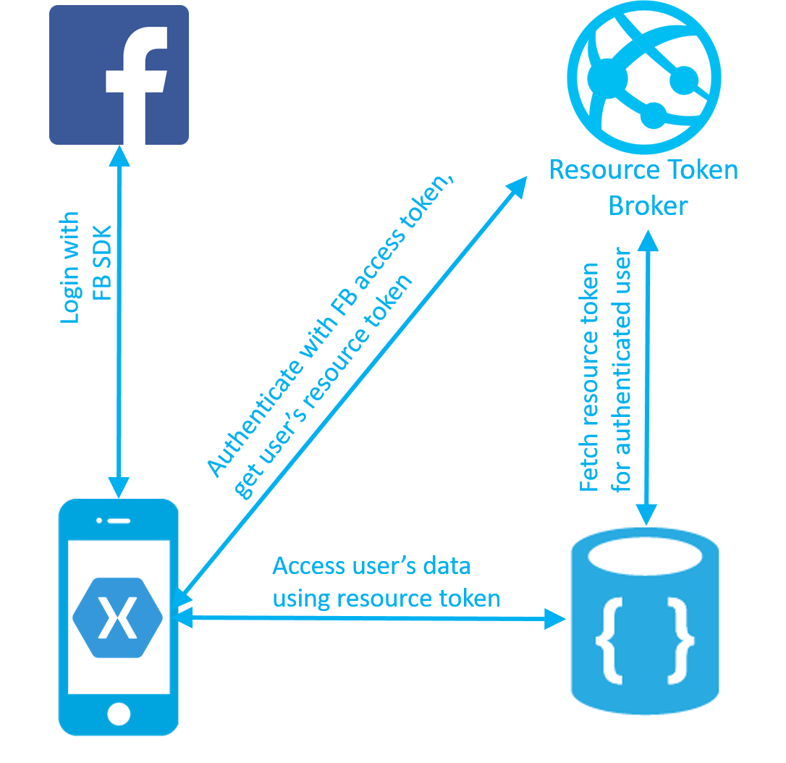

This sample illustrates how to use DocumentDB built-in authorization engine 
to implement per-user data pattern for a Xamarin mobile app.
It is a simple multi-user ToDo list app allowing users to login using 
Facebook Auth and manage their to do items.   

## Overview
This sample consists of:
- Xamarin app. The app stores user's todo items in a DocumentDB partitioned collection 
UserItems.
- Resource Token Broker API, a simple ASP.NET Web API to broker DocumentDB resource tokens 
to the logged in users of the app. Resource tokens are short-lived access tokens that 
provide the app with the access to the logged in user's data.

The authentication and data flow is illustrated in the diagram below.
- DocumentDB UserItems collection is created with partition key '/userid'. 
Specifying partition key for collection allows DocumentDB to scale infinitely 
as the number of users and items grows. 
- Xamarin app allows users to login with Facebook credentials.
- Xamarin app uses Facebook access token to authenticate with ResourceTokenBroker API
- Resource Token Broker API authenticates the request using App Service Auth feature, 
and requests a DocumentDB resoure token with read/write access to all documents sharing 
the authenticated user's partition key.
- Resource Token Broker returns the resource token to the client app.
- The app accesses user's todo items using the resource token.

## How to Run this sample?

- Step 1. In Azure portal create a DocumentDB account and a new collection 
UserItems specifying partition key /userid. 
- Step 2. In Azure portal create an App Service website to host Resource Token Broker API.
- Step 3. In Azure portal, open the App Settings blade of the Resource Token Broker API website. 
Fill in the following app settings:
  - accountUrl - the DocumentDB account URL from the Keys tab of your DocumentDB account.
  - accountKey - the DocumentDB account master key from the Keys tab of your DocumentDB account.
  - databaseId and collectionId of your created database and collection
 
- Step 4. Publish ResourceTokenBroker solution to your created website.
- Step 5. Open Xamarin project, and navigate to TodoItemManager.cs. 
Fill in the values for accountURL, collectionId, databaseId, as well as resourceTokenBrokerURL 
as the base https url for the resource token broker website.
- Step 6. Follow [this tutorial](https://docs.microsoft.com/en-us/azure/app-service-mobile/app-service-mobile-how-to-configure-facebook-authentication) to setup Facebook authentication and configure ResourceTokenBroker website.
- Step 7. Run the Xamarin app.
